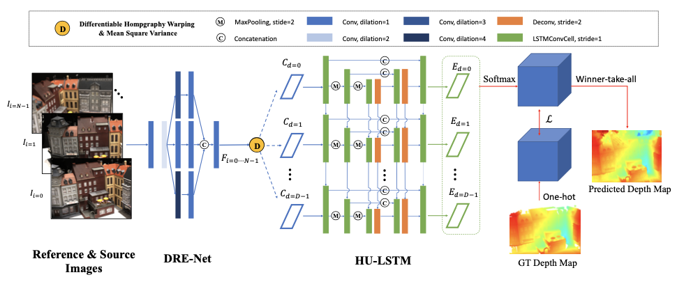
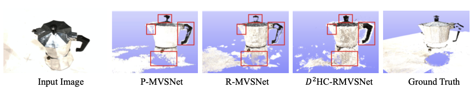
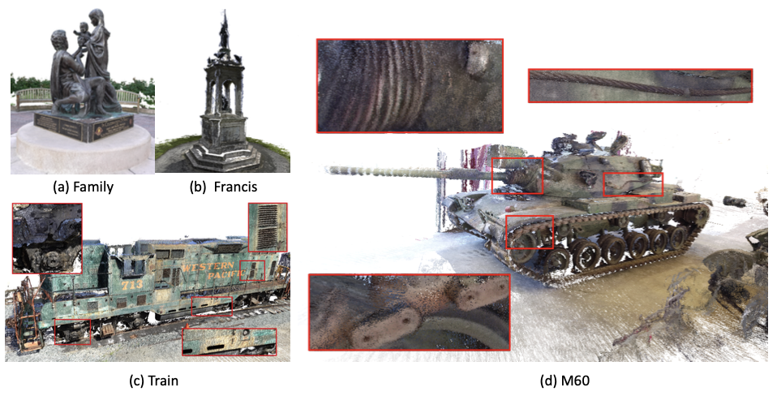
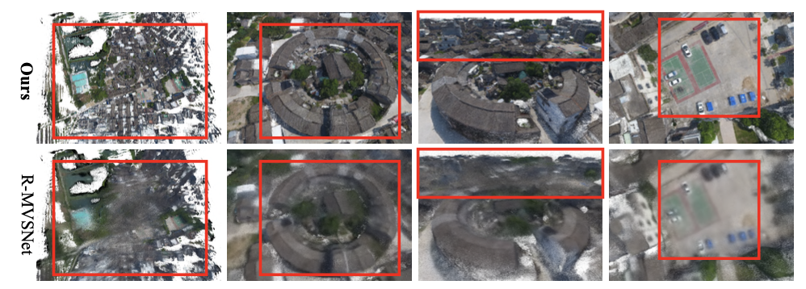

# D2HC-RMVSNet

Here is the official repository of our paper "[Dense Hybrid Recurrent Multi-view Stereo Net with Dynamic Consistency Checking](https://www.ecva.net/papers/eccv_2020/papers_ECCV/papers/123490647.pdf)" (ECCV2020 Spotlight).

 

## How to Use

### Requirements

* python 3.6
* Pytorch >= 1.0.0
* CUDA >= 9.0

### Install
``./conda_install.sh``

### Training

* Download the preprocessed [DTU training data](https://drive.google.com/file/d/1eDjh-_bxKKnEuz5h-HXS7EDJn59clx6V/view) (also available at [Baiduyun](https://pan.baidu.com/s/1Wb9E6BWCJu4wZfwxm_t4TQ#list/path=%2F), code: s2v2), and upzip it as the ``MVS_TRANING`` folder.
* Set ``dtu_data_root`` to your ``MVS_TRAINING`` path in ``env.sh``
Create a log folder and a model folder in wherever you like to save the training outputs. Set the ``log_dir`` and ``save_dir`` in ``train.sh`` correspondingly.
* Train:
``./train.sh``

### Testing
* Download our [pretrained model](https://drive.google.com/file/d/1YWhEn6YoT2G53XhWvxj3dPr4trYoeVe-/view?usp=sharing).
* Set ``TEST_DATA_FOLDER``.
* Set ``MODEL_FOLDER`` to ``ckpt`` and ``model_ckpt_index`` to ``checkpoint_list``.
* Run ``./eval_dtu.sh`` for DTU, or ``./eval_tanks.sh`` for Tanks and Temples.

### Fusion
* Run ``./fusion.sh`` for DTU or Tanks and Temples.

## Benchmark results

### Results on DTU
| Acc.   | Comp.  | Overall. |
|--------|--------|----------|
| 0.395  | 0.378  | 0.386    |

D2HC-RMVSNet point cloud results are provided: [DTU evaluation point clouds](https://drive.google.com/file/d/1wjAm6zOVahsa9G2QZjUOAv1EJV8Zjrng/view?usp=sharing).

Evaluate the point clouds using the [DTU evaluation code](http://roboimagedata.compute.dtu.dk/?page_id=36).

 

### Results on Tanks and Temples
| Mean   | Family | Francis | Horse  | Lighthouse | M60    | Panther | Playground | Train |
|--------|--------|---------|--------|------------|--------|---------|------------|-------|
| 59.20  |	74.69 |	 56.04	|  49.42 |    60.08   | 59.81  |  59.61  |   60.04    |	53.92 |

As shown on Tanks and Temples [leaderboard](https://www.tanksandtemples.org/leaderboard/).

 

### Results on BlendedMVS

 

The corresponding point cloud is provided: [BlendedMVS result](https://drive.google.com/file/d/1vXCNPjcnIzRQIFQU7X-DPANckOqFFPEM/view?usp=sharing).

The [rest reconstructed point clouds](https://drive.google.com/file/d/1FQs7wgaHnnxj25FMqfaIlZltiauP-f3G/view?usp=sharing) of the validation dataset of BlendedMVS are also provided. 

# Citation
If you find this project useful for your research, please cite:
```
@inproceedings{yan2020dense,
  title={Dense Hybrid Recurrent Multi-view Stereo Net with Dynamic Consistency Checking},
  author={Yan, Jianfeng and Wei, Zizhuang and Yi, Hongwei and Ding, Mingyu and Zhang, Runze and Chen, Yisong and Wang, Guoping and Tai, Yu-Wing},
  booktitle={ECCV},
  year={2020}
}
```
