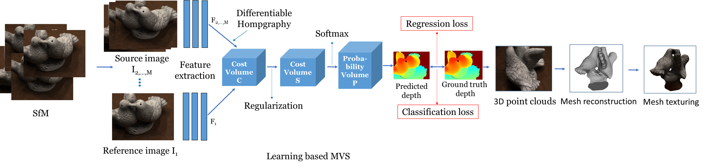
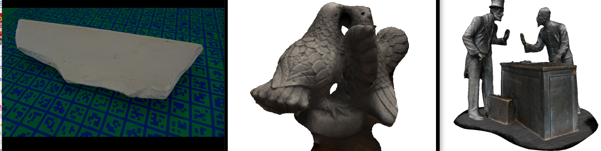

# DeepMVS


<p align="center">
Flowchart of DeepMVS
</p>

Deep learning methods have shown promising results in the area of 3D reconstruction. However, the existing 3D reconstruction projects like [Colmap](https://github.com/colmap/colmap) and [OpenMVS](https://github.com/cdcseacave/openMVS) are still based on traditional methods. Recently, the multi-view stereo methods, such as the [MVSNet](https://github.com/YoYo000/MVSNet) and its variants, have shown promising results in depth learning. Here, we build the 3D reconstruction project, which uses the learning based MVS methods for depth inferring. 

The whole project is the complete 3D reconstruction system. We use the [Colmap](https://github.com/colmap/colmap) for SfM, [CasMVSNet](https://github.com/kwea123/CasMVSNet_pl) and [D2HC-RMVSNet](https://github.com/yhw-yhw/D2HC-RMVSNet) for depth inferring and [OpenMVS](https://github.com/cdcseacave/openMVS) for dense point-cloud reconstruction, mesh reconstruction and mesh texturing. We write the codes to combine them together so it can do 3D reconstruction end to end.

The online demo video is at [DeepMVS](https://www.zhihu.com/zvideo/1443954079655063552), which describes how to use the project and some 3D reconstruction results. 

The highlights of our project are as follows:

1. We build the first deep learning based 3D reconstruction project, named DeepMVS.
2. DeepMVS is much faster and more accurate than  [OpenMVS](https://github.com/cdcseacave/openMVS).

# Installation

## Hardware

* OS: Ubuntu 16.04 or 18.04
* NVIDIA GPU with **CUDA>=10.0**

## Software

For OpenMVS:
Please refer to [OpenMVS](https://github.com/cdcseacave/openMVS/wiki/Building)

For CasMVSNet_pl and D2HC-RMVSNet:
Please refer to [CasMVSNet_pl](https://github.com/kwea123/CasMVSNet_pl) and [D2HC-RMVSNet](https://github.com/yhw-yhw/D2HC-RMVSNet) which are variants of  [MVSNet](https://github.com/YoYo000/MVSNet)

## Docker

We provide the docker image for environment:

```
docker pull xxx
```

## Usage

Note: the existing code is just OpenMVS, we will add the complete codes soon.

Run
```
bash demo.sh test_folder test_img_name

example:
bash demo_casmvsnet.sh example test0
```
## Reconstruction Results

<p align="center">
 Some Results
</p>

##  License

Our code and dataset are released under the Apache 2.0 license.

## Acknowledgement

This repository is based on [Colmap](https://github.com/colmap/colmap), [OpenMVS](https://github.com/cdcseacave/openMVS), [CasMVSNet_pl](https://github.com/kwea123/CasMVSNet_pl) and [D2HC-RMVSNet](https://github.com/yhw-yhw/D2HC-RMVSNet) .

TODO:
* Add the complete codes for OpenMVS
* Add [SuperPoint](https://github.com/rpautrat/SuperPoint) for SfM, like https://github.com/cvg/sfm-disambiguation-colmap
* Rifine the mesh building with [MVSDF](https://arxiv.org/pdf/2108.09964.pdf)
